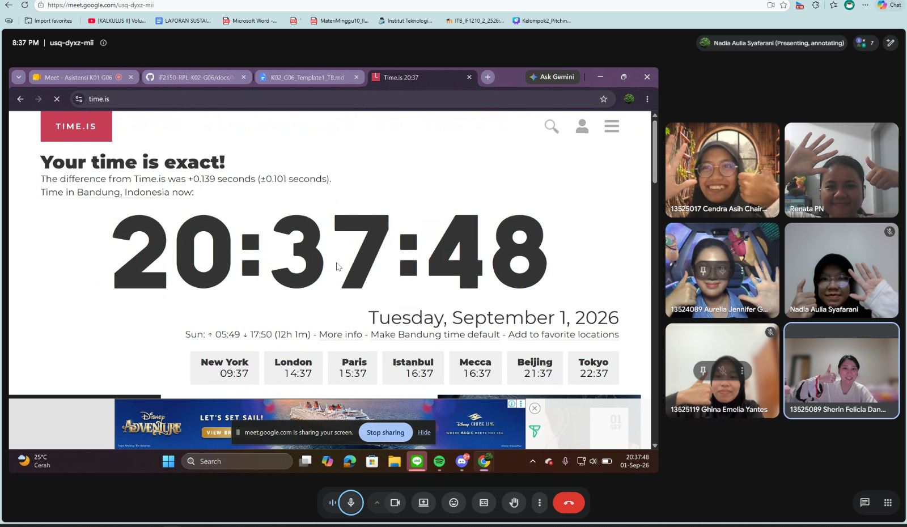

# Form Asistensi

## Tugas Besar IF2150 - Rekayasa Perangkat Lunak

| Informasi | Keterangan |
| --- | --- |
| **Hari** | *Selasa* |
| **Tanggal** | *01/09/2026* |
| **Kelas** | *K02* |
| **Nomor Kelompok** | *G06*  |
| **Nama Kelompok** | *Rengginang*  |
| **Nama Perangkat Lunak** | *Food Waste Stop*  |
| **Dokumen** | *K02_G06_Tugas1_TB*  |
| **Asisten** | *Aurelia Jennifer Gunawan* |

### Anggota Kelompok

| NIM | Nama |
| --- | --- |
| *13525120* | *Nadia Aulia Syafarani* |
| *13525041* | *Renata Puspanegara Ninagan* |
| *13525119* | *Ghina Emelia Yantes* |
| *13525017* | *Cendra Asih Chairunnisa* |
| *13525089* | *Sherin Felicia Danessa* |

### Catatan

| Catatan |
| --- |
| 1. Bagian latar belakang sudah cukup baik karena telah disertai data pendukung. Namun, perlu diperjelas sumber pernyataan mengenai "masih banyak praktik ...", apakah berasal dari data sekunder atau hasil pengamatan langsung, serta perlu ditambahkan gambaran atau contoh yang lebih spesifik. |
| 2. Uraian mengenai perangkat lunak sejenis beserta kekurangannya (yang sebelumnya disebutkan di latar belakang) sebaiknya dipindahkan ke bagian Analisis Kondisi. Sebutkan nama perangkat lunak pembanding beserta kekurangannya agar dapat menjadi celah (*gap*) yang diisi oleh perangkat lunak yang dikembangkan. |
| 3. Bagian deskripsi perlu diperbaiki dari segi bahasa, seperti gunakan istilah "perangkat lunak", bukan "*software*"; gunakan kalimat efektif; dan perhatikan keterhubungan antarkalimat, beberapa kalimat sebaiknya digabung dengan kalimat sebelumnya agar alurnya lebih koheren. |
| 4. Bagian asumsi dan batasan sebaiknya dipisahkan menjadi dua bagian tersendiri agar lebih mudah dibaca. Konten yang sudah ada sudah tepat dan tidak perlu diubah, hanya perlu diperbaiki dari segi format. |
| 5. Aktor yang telah ditentukan sudah tepat, cukup 2 aktor (Pembeli dan Penjual Kantin ITB), sehingga perangkat lunak nantinya akan memiliki 2 antarmuka. Penjelasan rinci mengenai masing-masing aktor sebaiknya dipindahkan ke bagian Deskripsi, sedangkan bagian Aktor cukup memuat identifikasi aktor secara singkat, tidak perlu terlalu panjang. |
| 6. Bagian tujuan dan nilai perlu dibakukan kembali dari segi bahasa; poin-poin yang masih berupa frasa singkat sebaiknya diubah menjadi kalimat lengkap. |
| 7. Terdapat bagian yang belum ditambahkan sesuai revisi template, yaitu tabel Deskripsi Aktivitas, yang menguraikan kebutuhan yang telah diidentifikasi menjadi aktivitas-aktivitas yang lebih rinci. |
| 8. Model proses bisnis sebaiknya tidak digabung menjadi satu diagram karena akan terlalu rumit; dapat dipecah menjadi beberapa diagram terpisah dengan judul yang menjelaskan cakupan masing-masing diagram. Proses yang digambarkan tidak boleh hanya mencakup sisi backend, karena Pembeli juga berinteraksi dengan frontend. Alur pada diagram diusahakan tidak banyak bersilangan agar mudah dibaca dan tidak mengurangi nilai. Sertakan pula tautan workspace untuk memastikan seluruh anggota kelompok benar-benar mengerjakan bagiannya. |

## Dokumentasi

  

  <i>Gambar 1. Dokumentasi kegiatan asistensi.</i>

